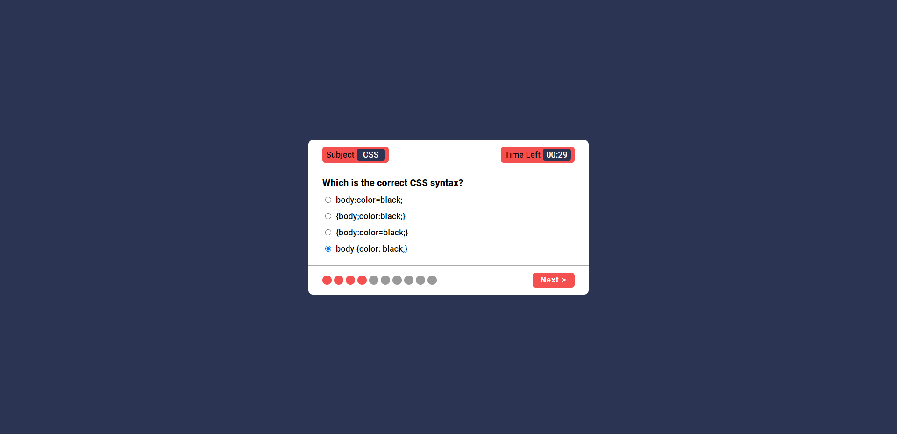
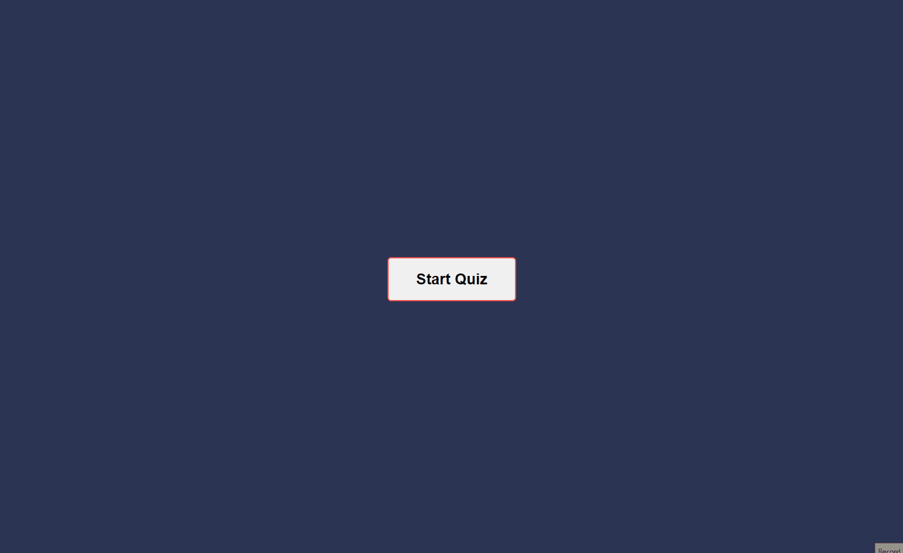

# Quiz Application 
this is a single-page application built with HTML, CSS and JavaScript.
that allows users to test their knowledge on various subjects.
It loads different quiz JSON data files to display questions with multiple choice answers.

## Overview

## Demo
> This gif shows a brief overview of the project, and it may take a while to load!

## Getting Started
To run this project locally using the Live Server extension in VS Code:
- Clone or download this repository
- Open the folder containing the project files in VS Code
- Install the Live Server extension
- Right click the index.html file and select "Open with Live Server"
  This will launch a development local server with hot reloading
- Select a quiz category and start answering questions!
